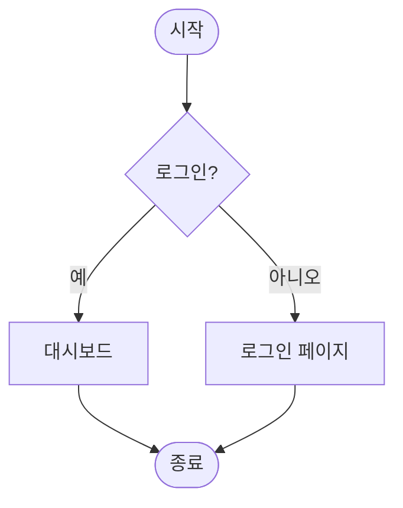

# README.md파일 작성
## ai를 활용한 백엔드 개발
**중요해** <br>


<hr>

---




```markdown
# Enhanced Simple Calculator

Java Swing을 이용한 **그래픽 계산기**입니다.  
더하기, 빼기, 곱하기, 나누기 기능을 지원하며, 예쁜 UI와 이미지, 아이콘을 추가한 강화된 버전입니다.

## ✨ 주요 기능

- **네 가지 기본 연산** (+, -, ×, ÷)
- **실수 계산 지원** (소수점 2자리까지 표시)
- **0으로 나누기 방지** 처리
- **예외 처리** (숫자가 아닌 값 입력 시 경고)
- **커스텀 UI**:
  - 컬러풀한 버튼
  - 상단 아이콘 + 제목
  - 하단 이미지 표시
  - 창 아이콘 설정
- **모달 다이얼로그**로 결과 출력

## 📁 프로젝트 구조


SimpleCalculator Project
├── SimpleCalculator.java          # 메인 소스 파일 (전체 코드)
├── 206.png                        # 창 아이콘 (window icon)
├── calculator_icon.png            # 상단에 표시될 계산기 아이콘
├── img.png                        # 버튼 아래에 표시될 이미지
└── README.md                      # 프로젝트 설명서
```

> **주의**: 이미지 파일들은 프로젝트 루트(컴파일된 `.class` 파일이 있는 위치)에 있어야 정상적으로 로드됩니다.

## 🚀 실행 방법

1. **Java Development Kit (JDK)** 8 이상 설치
2. 프로젝트 폴더에 모든 파일(소스 + 이미지) 배치
3. 컴파일:
   ```bash
   javac SimpleCalculator.java
   ```
4. 실행:
   ```bash
   java SimpleCalculator
   ```

또는 **IDE**(IntelliJ IDEA, Eclipse, VS Code 등)에서 바로 실행 가능합니다.

## 📋 전체 소스 코드

```java
package test;

import javax.swing.*;
import java.awt.*;
import java.awt.event.ActionEvent;
import java.awt.event.ActionListener;

public class SimpleCalculator extends JFrame implements ActionListener {

    private JTextField num1Field;
    private JTextField num2Field;
    private JButton addButton;
    private JButton subtractButton;
    private JButton multiplyButton;
    private JButton divideButton;

    private ImageIcon calculatorIcon;
    private JLabel iconLabel;

    private ImageIcon backgroundImageIcon;
    private JLabel imageLabel;

    public SimpleCalculator() {
        // --- Frame Setup ---
        setTitle("Enhanced Simple Calculator");
        setSize(500, 550);
        setDefaultCloseOperation(JFrame.EXIT_ON_CLOSE);
        setLayout(new BorderLayout(10, 10));
        getContentPane().setBackground(Color.GREEN);

        // --- Window Icon ---
        try {
            Image windowIcon = Toolkit.getDefaultToolkit().getImage("206.png");
            setIconImage(windowIcon);
        } catch (Exception e) {
            System.err.println("Warning: Could not set window icon from '206.png'.");
        }

        // --- Top Panel ---
        JPanel topPanel = new JPanel(new FlowLayout(FlowLayout.CENTER, 15, 15));
        topPanel.setBackground(new Color(176, 196, 222));

        try {
            calculatorIcon = new ImageIcon("calculator_icon.png");
            Image img = calculatorIcon.getImage();
            Image scaledImg = img.getScaledInstance(50, 50, Image.SCALE_SMOOTH);
            calculatorIcon = new ImageIcon(scaledImg);
            iconLabel = new JLabel(calculatorIcon);
            topPanel.add(iconLabel);
        } catch (Exception e) {
            iconLabel = new JLabel("Calculator");
            topPanel.add(iconLabel);
        }

        JLabel titleLabel = new JLabel("Simple Calculator");
        titleLabel.setFont(new Font("Arial", Font.BOLD, 24));
        titleLabel.setForeground(new Color(70, 130, 180));
        topPanel.add(titleLabel);

        add(topPanel, BorderLayout.NORTH);

        // --- Center Panel ---
        JPanel centerPanel = new JPanel(new BorderLayout(10, 10));
        centerPanel.setBackground(Color.GREEN);

        // Input Panel
        JPanel inputPanel = new JPanel(new GridLayout(2, 2, 10, 10));
        inputPanel.setBackground(Color.GREEN);

        JLabel num1Label = new JLabel("First Number:");
        num1Label.setHorizontalAlignment(JLabel.RIGHT);
        num1Label.setFont(new Font("Arial", Font.PLAIN, 16));
        num1Field = new JTextField();

        JLabel num2Label = new JLabel("Second Number:");
        num2Label.setHorizontalAlignment(JLabel.RIGHT);
        num2Label.setFont(new Font("Arial", Font.PLAIN, 16));
        num2Field = new JTextField();

        inputPanel.add(num1Label);
        inputPanel.add(num1Field);
        inputPanel.add(num2Label);
        inputPanel.add(num2Field);

        centerPanel.add(inputPanel, BorderLayout.NORTH);

        // Button Panel
        JPanel buttonPanel = new JPanel(new FlowLayout(FlowLayout.CENTER, 15, 15));
        buttonPanel.setBackground(Color.GREEN);

        addButton = new JButton("+");
        subtractButton = new JButton("-");
        multiplyButton = new JButton("*");
        divideButton = new JButton("/");

        Dimension buttonSize = new Dimension(70, 45);
        // Button styling ...
        addButton.setPreferredSize(buttonSize);
        addButton.setBackground(new Color(144, 238, 144));
        addButton.setFont(new Font("Arial", Font.BOLD, 25));

        subtractButton.setPreferredSize(buttonSize);
        subtractButton.setBackground(new Color(255, 182, 193));
        subtractButton.setFont(new Font("Arial", Font.BOLD, 25));

        multiplyButton.setPreferredSize(buttonSize);
        multiplyButton.setBackground(new Color(255, 218, 185));
        multiplyButton.setFont(new Font("Arial", Font.BOLD, 25));

        divideButton.setPreferredSize(buttonSize);
        divideButton.setBackground(new Color(173, 216, 230));
        divideButton.setFont(new Font("Arial", Font.BOLD, 25));

        buttonPanel.add(addButton);
        buttonPanel.add(subtractButton);
        buttonPanel.add(multiplyButton);
        buttonPanel.add(divideButton);

        centerPanel.add(buttonPanel, BorderLayout.CENTER);

        // Image Panel (Below Buttons)
        JPanel imagePanel = new JPanel(new FlowLayout(FlowLayout.CENTER));
        imagePanel.setBackground(Color.GREEN);

        try {
            backgroundImageIcon = new ImageIcon("img.png");
            Image img = backgroundImageIcon.getImage();
            Image scaledImg = img.getScaledInstance(300, 200, Image.SCALE_SMOOTH);
            backgroundImageIcon = new ImageIcon(scaledImg);
            imageLabel = new JLabel(backgroundImageIcon);
            imagePanel.add(imageLabel);
        } catch (Exception e) {
            imagePanel.add(new JLabel("Image not found"));
        }

        centerPanel.add(imagePanel, BorderLayout.SOUTH);
        add(centerPanel, BorderLayout.CENTER);

        // Action Listeners
        addButton.addActionListener(this);
        subtractButton.addActionListener(this);
        multiplyButton.addActionListener(this);
        divideButton.addActionListener(this);

        setVisible(true);
    }

    @Override
    public void actionPerformed(ActionEvent e) {
        try {
            double num1 = Double.parseDouble(num1Field.getText());
            double num2 = Double.parseDouble(num2Field.getText());
            double result = 0;
            String operation = "";

            if (e.getSource() == addButton) {
                operation = "+";
                result = num1 + num2;
            } else if (e.getSource() == subtractButton) {
                operation = "-";
                result = num1 - num2;
            } else if (e.getSource() == multiplyButton) {
                operation = "*";
                result = num1 * num2;
            } else if (e.getSource() == divideButton) {
                operation = "/";
                if (num2 == 0) {
                    JOptionPane.showMessageDialog(this, "Error: Division by zero is not allowed.", "Calculation Error", JOptionPane.ERROR_MESSAGE);
                    return;
                }
                result = num1 / num2;
            }

            String resultMessage = String.format("%.2f %s %.2f = %.2f", num1, operation, num2, result);
            JOptionPane.showMessageDialog(this, resultMessage, "Calculation Result", JOptionPane.INFORMATION_MESSAGE);

        } catch (NumberFormatException ex) {
            JOptionPane.showMessageDialog(this, "Error: Invalid input. Please enter valid numbers.", "Input Error", JOptionPane.ERROR_MESSAGE);
        } catch (Exception ex) {
            JOptionPane.showMessageDialog(this, "An unexpected error occurred.", "Error", JOptionPane.ERROR_MESSAGE);
        }
    }

    public static void main(String[] args) {
        SwingUtilities.invokeLater(() -> new SimpleCalculator());
    }
}
```

## 📖 주요 개념 설명

| 개념 | 설명 |
|------|------|
| **JFrame** | Swing 최상위 컨테이너 (창 자체) |
| **JPanel** | 컴포넌트들을 그룹화하는 패널 |
| **BorderLayout** | NORTH, CENTER, SOUTH, EAST, WEST 5개 영역 |
| **GridLayout** | 행×열 격자 배치 (입력 필드에 사용) |
| **FlowLayout** | 좌→우 순서대로 배치 (버튼, 아이콘) |
| **ActionListener** | 버튼 클릭 이벤트를 처리하는 인터페이스 |
| **JOptionPane** | 모달 다이얼로그 (결과, 오류 메시지) |
| **ImageIcon + JLabel** | 이미지 표시 |
| **Toolkit.getImage()** | 창 아이콘 설정 |

**Swing Thread Safety**: `SwingUtilities.invokeLater()`를 사용하여 Event Dispatch Thread(EDT)에서 GUI를 생성합니다.

## 🔗 참고 자료

- [Java Swing 공식 튜토리얼 (Oracle)](https://docs.oracle.com/javase/tutorial/uiswing/)
- [Java GUI Programming - Swing Layout Managers](https://docs.oracle.com/javase/tutorial/uiswing/layout/index.html)
- [JButton, ActionListener 예제](https://www.javatpoint.com/java-swing)
- [ImageIcon 사용법](https://docs.oracle.com/javase/8/docs/api/javax/swing/ImageIcon.html)
- [Java Swing Best Practices](https://www.baeldung.com/java-swing-best-practices)

---

필요하면 **빌드 스크립트**(Maven/Gradle) 버전이나 **JAR 파일** 만드는 방법도 추가해 드릴 수 있습니다!
원하는 부분이 더 있으면 말씀해주세요.
```
